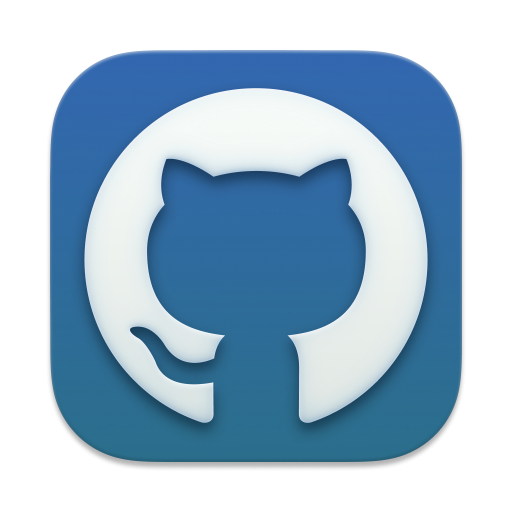

<div align="center">
  

  <h1>Luma</h1>

  <p><strong>Поддерживаемый Stapler-репозиторий для установки Linux-приложений из проверяемых upstream-источников.</strong></p>

  <p>
    <a href="https://github.com/Cheviiot/luma"></a>
    
    
  </p>

  <p>
    <code>stplr &gt;= v0.1.1</code>
    <code>18 пакетов</code>
    <code>amd64</code>
    <code>arm64</code>
    <code>all</code>
  </p>
</div>

---

## Обзор

| Направление | Состояние |
|:--|:--|
| Назначение | Единая витрина пакетов для Stapler: desktop-приложения, VPN-клиенты, инструменты разработки и игровые лаунчеры. |
| Источники | Используются реальные upstream-артефакты: `.deb`, `.tgz`, AppImage, исходные архивы и локальные иконки пакетов. |
| Контроль | У каждого пакета есть `Staplerfile`, `stapler-repo.toml`, `.stapler/update-check`, `LICENSE`, install/remove-скрипты при необходимости. |
| Обновления | Общий скрипт сверяет версии, пересчитывает SHA256 и синхронизирует README. |
| Поддержка | Ошибки по пакетам принимаются через [GitHub Issues](https://github.com/Cheviiot/luma/issues). |

## Быстрый старт

```bash
stplr repo add luma https://github.com/Cheviiot/luma.git
stplr refresh
stplr install luma/warp
```

Если репозиторий уже находится на машине:

```bash
stplr repo import luma stapler-repo.toml
stplr refresh
```

Полезные команды:

```bash
stplr search --query "name.contains('vpn')"
stplr info luma/codex-app
stplr install luma/codex-app
stplr install luma/pineconemc
stplr install luma/prismlauncher
stplr upgrade
```

## Каталог

### Сеть и VPN

| Приложение | Версия | Архитектуры | Первоисточник | Установка |
|:--|:--:|:--:|:--|:--|
|  [Clash Verge Rev](./clash-verge)<br><sub>GUI-клиент на Tauri для профилей Mihomo/Clash.</sub> | `2.5.1` | `amd64`, `arm64` | [clashverge.dev](https://www.clashverge.dev) | `stplr install luma/clash-verge` |
|  [Happ](./happ)<br><sub>Удобный GUI-прокси-клиент для xray-core.</sub> | `2.17.1` | `amd64`, `arm64` | [happ.su](https://happ.su/) | `stplr install luma/happ` |
|  [NetBird](./netbird)<br><sub>Mesh VPN-клиент на базе WireGuard с SSO и политиками доступа.</sub> | `0.72.4` | `amd64`, `arm64` | [netbird.io](https://netbird.io/) | `stplr install luma/netbird` |
|  [NetBird UI](./netbird-ui)<br><sub>Графический интерфейс для управления NetBird на рабочем столе.</sub> | `0.72.4` | `amd64` | [netbird.io](https://netbird.io/) | `stplr install luma/netbird && stplr install luma/netbird-ui` |
|  [Tailscale](./tailscale)<br><sub>Mesh VPN на базе WireGuard для приватных сетей.</sub> | `1.98.4` | `amd64`, `arm64` | [tailscale.com](https://tailscale.com) | `stplr install luma/tailscale` |
|  [VanyaVPN](./vanyavpn)<br><sub>Десктопный клиент сервиса VanyaVPN, перепакованный из AppImage.</sub> | `1.12.1+472165` | `amd64` | [vanyavpn.es](https://vanyavpn.es) | `stplr install luma/vanyavpn` |

### Разработка

| Приложение | Версия | Архитектуры | Первоисточник | Установка |
|:--|:--:|:--:|:--|:--|
|  [Codex App](./codex-app)<br><sub>Неофициальная Linux-перепаковка десктопного приложения Codex.</sub> | `26.608.12217` | `amd64` | [Boria138/codex-app-linux](https://github.com/Boria138/codex-app-linux) | `stplr install luma/codex-app` |
|  [GitHub Desktop Plus](./github-plus)<br><sub>Форк GitHub Desktop с интеграцией Bitbucket и GitLab.</sub> | `3.5.13.0` | `amd64`, `arm64` | [pol-rivero/github-desktop-plus](https://github.com/pol-rivero/github-desktop-plus) | `stplr install luma/github-plus` |
|  [Terax](./terax)<br><sub>AI-native эмулятор терминала на Tauri, Rust и React.</sub> | `0.8.0` | `amd64` | [terax.app](https://terax.app) | `stplr install luma/terax` |
|  [Warp](./warp)<br><sub>Терминал на Rust для разработчиков и команд.</sub> | `0.2026.06.10.09.27.stable.01` | `amd64`, `arm64` | [warp.dev](https://warp.dev/) | `stplr install luma/warp` |
|  [Windsurf](./windsurf)<br><sub>AI-редактор кода для сохранения flow state.</sub> | `2.3.15` | `amd64` | [windsurf.com](https://windsurf.com/) | `stplr install luma/windsurf` |

### Рабочий стол и игры

| Приложение | Версия | Архитектуры | Первоисточник | Установка |
|:--|:--:|:--:|:--|:--|
|  [Adwyra](./adwyra)<br><sub>Минималистичный лаунчер приложений для GNOME.</sub> | `0.5.0` | `all` | [Cheviiot/Adwyra](https://github.com/Cheviiot/Adwyra) | `stplr install luma/adwyra` |
|  [Hydra Launcher](./hydralauncher)<br><sub>Открытый игровой лаунчер со встроенной поддержкой BitTorrent.</sub> | `4.0.0` | `amd64` | [hydralauncher.app](https://hydralauncher.app/dl/) | `stplr install luma/hydralauncher` |
|  [Modrinth App](./modrinth-app)<br><sub>Официальный лаунчер Modrinth для модов и модпаков Minecraft.</sub> | `0.14.6` | `amd64` | [modrinth.com/app](https://modrinth.com/app) | `stplr install luma/modrinth-app` |
|  [Parsec](./parsec)<br><sub>Удаленный рабочий стол и игровой стриминг с низкой задержкой.</sub> | `150-97c` | `amd64` | [parsec.app/downloads](https://parsec.app/downloads) | `stplr install luma/parsec` |
|  [PineconeMC](./pineconemc)<br><sub>Форк Prism Launcher с поддержкой Ely.by и offline-аккаунтов.</sub> | `11.0.2` | `amd64`, `arm64` | [pineconemc.com](https://pineconemc.com/) | `stplr install luma/pineconemc` |
|  [Prism Launcher](./prismlauncher)<br><sub>Лаунчер Minecraft для ванильных и модифицированных сборок.</sub> | `11.0.2` | `amd64`, `arm64` | [prismlauncher.org](https://prismlauncher.org/) | `stplr install luma/prismlauncher` |
|  [Vual](./vual)<br><sub>Запуск Cheat Engine для Steam-игр через Proton.</sub> | `0.3.1` | `all` | [Cheviiot/Vual](https://github.com/Cheviiot/Vual) | `stplr install luma/vual` |

## Принципы качества

| Контур | Что проверяется |
|:--|:--|
| Версии | `.stapler/update-check` сверяет локальную версию с upstream-релизом или официальным каналом поставки. |
| Целостность | `checksums` пересчитываются по фактически скачанным источникам, включая `sources_arm64`. |
| Интеграция | Postinstall-скрипты обновляют desktop-базу, icon-cache, systemd-сервисы и права файлов там, где это нужно. |
| Лицензии | В каждом пакете есть `LICENSE` с русским описанием лицензии, источника и нюансов распространения. |
| Аудит | [docs/STAPLER_AUDIT.md](./docs/STAPLER_AUDIT.md) фиксирует сверку Luma с документацией Stapler и дальнейшие шаги. |

## Полная сводка

| Пакет | Категория | Upstream | Версия | Лицензия | Архитектуры |
|:--|:--|:--|:--:|:--|:--:|
| `adwyra` | Рабочий стол | [Adwyra](https://github.com/Cheviiot/Adwyra) | `0.5.0` | `GPL-3.0-or-later` | `all` |
| `clash-verge` | Сеть и VPN | [Clash Verge Rev](https://www.clashverge.dev) | `2.5.1` | `GPL-3.0-only` | `amd64`, `arm64` |
| `codex-app` | Разработка | [Codex App Linux](https://github.com/Boria138/codex-app-linux) | `26.608.12217` | `Custom` | `amd64` |
| `github-plus` | Разработка | [GitHub Desktop Plus](https://github.com/pol-rivero/github-desktop-plus) | `3.5.13.0` | `MIT` | `amd64`, `arm64` |
| `happ` | Сеть и VPN | [Happ](https://happ.su/) | `2.17.1` | `Custom` | `amd64`, `arm64` |
| `hydralauncher` | Игры | [Hydra Launcher](https://hydralauncher.app/dl/) | `4.0.0` | `MIT` | `amd64` |
| `modrinth-app` | Игры | [Modrinth App](https://modrinth.com/app) | `0.14.6` | `GPL-3.0-only` | `amd64` |
| `netbird` | Сеть и VPN | [NetBird](https://netbird.io/) | `0.72.4` | `BSD-3-Clause`, `AGPL-3.0-only` | `amd64`, `arm64` |
| `netbird-ui` | Сеть и VPN | [NetBird UI](https://netbird.io/) | `0.72.4` | `BSD-3-Clause`, `AGPL-3.0-only` | `amd64` |
| `parsec` | Рабочий стол и игры | [Parsec](https://parsec.app/downloads) | `150-97c` | `Custom` | `amd64` |
| `pineconemc` | Игры | [PineconeMC](https://pineconemc.com/) | `11.0.2` | `GPL-3.0-only` | `amd64`, `arm64` |
| `prismlauncher` | Игры | [Prism Launcher](https://prismlauncher.org/) | `11.0.2` | `GPL-3.0-only` | `amd64`, `arm64` |
| `tailscale` | Сеть и VPN | [Tailscale](https://tailscale.com) | `1.98.4` | `BSD-3-Clause` | `amd64`, `arm64` |
| `terax` | Разработка | [Terax](https://terax.app) | `0.8.0` | `Apache-2.0` | `amd64` |
| `vanyavpn` | Сеть и VPN | [VanyaVPN](https://vanyavpn.es) | `1.12.1+472165` | `Custom` | `amd64` |
| `vual` | Игры | [Vual](https://github.com/Cheviiot/Vual) | `0.3.1` | `GPL-3.0-or-later` | `all` |
| `warp` | Разработка | [Warp](https://warp.dev/) | `0.2026.06.10.09.27.stable.01` | `AGPL-3.0-only`, `MIT` | `amd64`, `arm64` |
| `windsurf` | Разработка | [Windsurf](https://windsurf.com/) | `2.3.15` | `Custom` | `amd64` |

## Сопровождение

### Структура пакета

| Файл | Назначение |
|:--|:--|
| `Staplerfile` | Сборочная спецификация пакета. |
| `stapler-repo.toml` | Наследование настроек репозитория. |
| `.stapler/update-check` | Проверка актуальной версии исходного проекта. |
| `postinstall.sh` | Действия после установки: desktop-cache, icon-cache, systemd, права файлов. |
| `postremove.sh` | Очистка системной интеграции после удаления пакета. |
| `LICENSE` | Русское описание лицензии и ограничений поставки. |

### Проверки

```bash
find . -path './.git' -prune -o \( -name 'Staplerfile' -o -name '*.sh' -o -path '*/.stapler/*' \) -type f -print0 | xargs -0 -r bash -n
find . -path './.git' -prune -o \( -name '*.sh' -o -path '*/.stapler/*' \) -type f -print0 | xargs -0 -r shellcheck
find . -path './.git' -prune -o \( -name 'Staplerfile' -o -name '*.sh' -o -path '*/.stapler/*' \) -type f -print0 | xargs -0 -r shfmt -d -i 4
python3 -m py_compile .github/scripts/validate-repo.py
.github/scripts/validate-repo.py
git diff --check
```

### Сборка

```bash
cd codex-app
stplr build --clean
```

Для чистой сборки через `stplr-spec`, если он установлен:

```bash
cd codex-app
stplr-spec clean-build --preset aides
```

### Обновление версий

```bash
.github/scripts/package-update.sh check-all
.github/scripts/package-update.sh apply-all
```

`apply` и `apply-all` обновляют версию, сбрасывают `release` на `1`, пересчитывают checksums и синхронизируют строки пакета в README. После обновления нужно проверить сборку измененных пакетов и добавить запись в CHANGELOG.

## Иконки

Иконки витрины взяты из артефактов исходных проектов: `.deb`, AppImage, `.tgz` или исходных архивов. Для `tailscale`, чей Linux CLI-архив не содержит desktop-иконку, используется официальный `favicon.svg` с сайта Tailscale.
