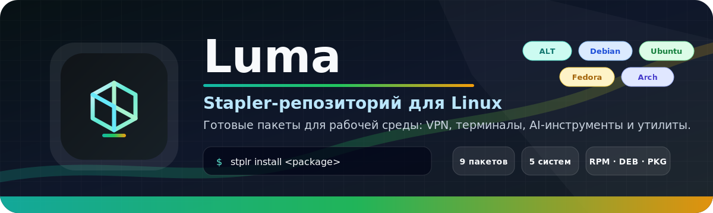

<div align="center">



<h1>Luma</h1>

<p>
  <strong>Аккуратный Stapler-репозиторий для полезных Linux-приложений.</strong>
</p>

<p>
  VPN-клиенты, AI-терминалы, редакторы, лаунчеры и утилиты рабочего стола в одном месте.
</p>

<p>
  <a href="#быстрый-старт">Быстрый старт</a>
  ·
  <a href="#пакеты">Пакеты</a>
  ·
  <a href="#поддержка-linux">Поддержка Linux</a>
  ·
  <a href="#проверка">Проверка</a>
  ·
  <a href="#обслуживание">Обслуживание</a>
</p>

[](https://stplr.dev)
[](#пакеты)
[](#проверка)
[](#лицензии)

</div>

---

<table>
  <tr>
    <td align="center" width="25%"><strong>10 пакетов</strong><br><sub>с понятными Staplerfile</sub></td>
    <td align="center" width="25%"><strong>5 систем</strong><br><sub>проверенная Docker-матрица</sub></td>
    <td align="center" width="25%"><strong>3 формата</strong><br><sub>RPM, DEB, PKG</sub></td>
    <td align="center" width="25%"><strong>1 команда</strong><br><sub><code>stplr install</code></sub></td>
  </tr>
</table>

## Быстрый старт

```bash
stplr repo add luma https://github.com/Cheviiot/Luma.git
stplr refresh
stplr install warp
```

## Пакеты

<table>
  <tr>
    <td align="center" width="33%">
      <br>
      <strong>Clash Verge</strong><br>
      <code>clash-verge</code><br>
      <sub>Сеть и VPN · Mihomo GUI</sub><br>
      <sub><code>2.4.7</code> · amd64/arm64 · GPL-3.0-only</sub>
    </td>
    <td align="center" width="33%">
      <br>
      <strong>Happ</strong><br>
      <code>happ</code><br>
      <sub>Сеть и VPN · xray-core GUI</sub><br>
      <sub><code>2.14.0</code> · amd64/arm64 · Proprietary</sub>
    </td>
    <td align="center" width="33%">
      <br>
      <strong>VanyaVPN</strong><br>
      <code>vanyavpn</code><br>
      <sub>Сеть и VPN · клиент сервиса</sub><br>
      <sub><code>1.12.3</code> · amd64 · Proprietary</sub>
    </td>
  </tr>
  <tr>
    <td align="center" width="33%">
      <br>
      <strong>Tailscale</strong><br>
      <code>tailscale</code><br>
      <sub>Сеть и VPN · WireGuard mesh VPN</sub><br>
      <sub><code>1.96.4</code> · amd64/arm64 · BSD-3-Clause</sub>
    </td>
    <td align="center" width="33%">
    </td>
    <td align="center" width="33%">
    </td>
  </tr>
  <tr>
    <td align="center" width="33%">
      <br>
      <strong>GitHub Desktop Plus</strong><br>
      <code>github-plus</code><br>
      <sub>Разработка · GUI-клиент Git</sub><br>
      <sub><code>3.5.9.2</code> · amd64/arm64 · MIT</sub>
    </td>
    <td align="center" width="33%">
      <br>
      <strong>Terax</strong><br>
      <code>terax</code><br>
      <sub>Разработка · AI-native терминал</sub><br>
      <sub><code>0.6.5</code> · amd64 · Apache-2.0</sub>
    </td>
    <td align="center" width="33%">
      <br>
      <strong>Warp</strong><br>
      <code>warp</code><br>
      <sub>Разработка · современный терминал</sub><br>
      <sub><code>2026.05.13</code> · amd64/arm64 · mixed</sub>
    </td>
  </tr>
  <tr>
    <td align="center" width="33%">
      <br>
      <strong>Windsurf</strong><br>
      <code>windsurf</code><br>
      <sub>Разработка · AI-редактор кода</sub><br>
      <sub><code>2.2.17</code> · amd64 · Proprietary</sub>
    </td>
    <td align="center" width="33%">
      <br>
      <strong>Adwyra</strong><br>
      <code>adwyra</code><br>
      <sub>Рабочий стол · лаунчер приложений</sub><br>
      <sub><code>0.5.0</code> · all · GPL-3.0-or-later</sub>
    </td>
    <td align="center" width="33%">
      <br>
      <strong>Vual</strong><br>
      <code>vual</code><br>
      <sub>Утилиты · Steam/Proton helper</sub><br>
      <sub><code>0.3.1</code> · all · GPL-3.0-or-later</sub>
    </td>
  </tr>
</table>

## Поддержка Linux

Luma подтверждает работу только на системах из матрицы ниже. Остальные дистрибутивы в рамках этого репозитория не тестировались.

| Система | Docker-образ | Формат | Статус |
|:--|:--|:--:|:--|
| ALT Linux p11 | `alt:p11` | RPM | подтверждено |
| Debian 13 | `debian:13-slim` | DEB | подтверждено |
| Ubuntu 24.04 | `ubuntu:24.04` | DEB | подтверждено |
| Fedora | `fedora:latest` | RPM | подтверждено |
| Arch Linux | `archlinux:latest` | PKG | подтверждено |

## Команды Stapler

| Задача | Команда |
|:--|:--|
| Обновить индексы | `stplr refresh` |
| Найти пакет | `stplr search <запрос>` |
| Посмотреть сведения | `stplr info <пакет>` |
| Установить пакет | `stplr install <пакет>` |
| Удалить пакет | `stplr remove <пакет>` |
| Обновить установленные пакеты | `stplr upgrade` |

## Проверка

<details>
<summary><strong>Быстрая локальная проверка</strong></summary>

```bash
find . -path './.git' -prune -o -name 'Staplerfile' -type f -print0 | xargs -0 -r bash -n
find . -path './.git' -prune -o -name '*.sh' -type f -print0 | xargs -0 -r bash -n
git diff --check
```

В GitHub Actions за быструю проверку отвечает workflow `Test Packages`.

</details>

<details>
<summary><strong>Lifecycle-тест пакета: сборка, установка, удаление</strong></summary>

```bash
docker build -f .github/test/Dockerfile -t luma-test .
docker run --rm --privileged luma-test
```

Один пакет:

```bash
docker run --rm --privileged luma-test happ
```

</details>

<details>
<summary><strong>Docker-матрица дистрибутивов</strong></summary>

```bash
# Все подтвержденные системы
./.github/test/test-distros.sh

# Один пакет во всей матрице
./.github/test/test-distros.sh warp

# Один пакет в выбранных системах
LUMA_DISTROS="debian-13 ubuntu-24.04 fedora" ./.github/test/test-distros.sh warp
```

</details>

## Обслуживание

Версии проверяются через GitHub Actions каждый день в `06:00 UTC`. Workflow `Check Package Versions` запускает `.github/scripts/update-versions.sh` и создает Pull Request, если upstream выпустил новую версию.

```bash
# Проверить все пакеты без изменений
./.github/scripts/update-versions.sh -n

# Проверить и применить обновления
./.github/scripts/update-versions.sh

# Обновить один пакет
./.github/scripts/update-versions.sh happ

# Пересчитать checksums без смены версии
./.github/scripts/update-versions.sh -c happ
```

## Структура

```text
.
├── README.md
├── stapler-repo.toml
├── .github/
│   ├── assets/
│   ├── lib/
│   ├── scripts/
│   ├── test/
│   └── workflows/
├── adwyra/
├── clash-verge/
├── github-plus/
├── happ/
├── tailscale/
├── terax/
├── vanyavpn/
├── vual/
├── warp/
└── windsurf/
```

Подробная структура автоматизации описана в `.github/README.md`. В каталоге каждого пакета лежит `Staplerfile`, локальные настройки репозитория, установочные скрипты и файл лицензии, если он требуется upstream-проектом.

## Лицензии

Лицензии отличаются от пакета к пакету. Перед распространением, модификацией или коммерческим использованием проверяйте `LICENSE` внутри нужного каталога и условия исходного проекта.

---

<div align="center">

<sub>Luma держит полезные Linux-приложения в одном понятном Stapler-репозитории.</sub>

</div>
